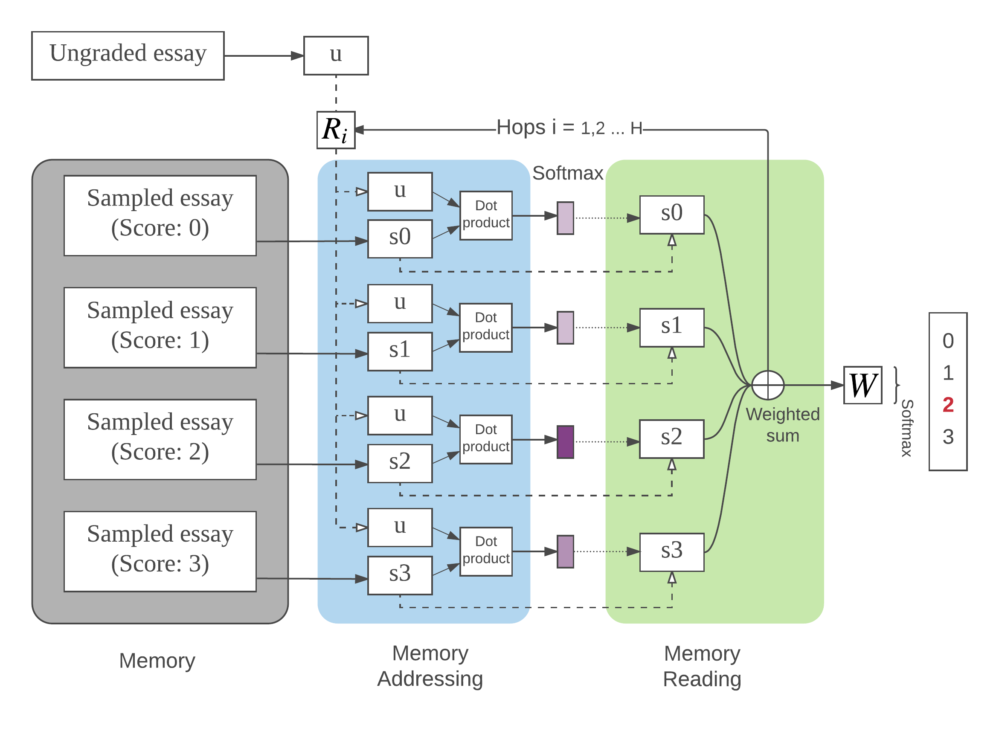

# Automated Essay Grading
Source code for the paper [A Memory-Augmented Neural Model for Automated Grading](http://dl.acm.org/citation.cfm?doid=3051457.3053982) in L@S 2017.
**Note** that recent check-in updates the python from python 2.5 to python 3.7.


The dataset comes from Kaggle ASAP competition. You can download the data from the link below.

[https://www.kaggle.com/c/asap-aes/data](https://www.kaggle.com/c/asap-aes/data)

Glove embeddings are used in this work. Specifically, 42B 300d is used to get the best results. You can download the embeddings from the link below.

https://nlp.stanford.edu/projects/glove/

### Get Started

```
git clone https://github.com/siyuanzhao/automated-essay-grading.git
```

* Download training data file 'training_set_rel3.tsv' from [Kaggle](https://www.kaggle.com/c/asap-aes/data) and put it under the root folder of this repo.

* Download 'glove.42B.300d.zip' from [https://nlp.stanford.edu/projects/glove/](https://nlp.stanford.edu/projects/glove/) and unzip all files into 'glove/' folder.

### Requirements
* Tensorflow 1.10
* scikit-learn 0.19
* six 1.10.0
* **python 3.7**

### Usage
```
# Train the model on an essay set <essay_set_id>
python cv_train.py --essay_set_id <eassy_set_id>
```

There are serval flags within cv_train.py. Below is an example of training the model on essay set 1 with specific learning rate, and epochs.

```
python cv_train.py --essay_set_id 1 --learning_rate 0.005 --epochs 200
```
Check all avaiable flags with the following command.

```
python cv_train.py -h
```

**Note**: The model is trained on the training data with 5-fold cross validation. By default, the output layer of the model is a classification layer. There is another model whose output layer is a regression layer in *memn2n_kv_regression.py*. To train the model with the regression output layer, set flag is_regression to True. For example,

```
python cv_train.py --essay_set_id 1 --learning_rate 0.005 --epochs 200 --is_regression True
```


